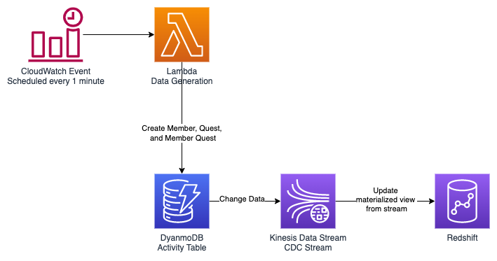

# Near Realtime Analytics of DynamoDB Data with Redshift Streaming Ingestion

This demo shows how you can use Redshift Streaming Ingestion (Preview) to sync DynamoDB data with Redshift in near realtime for ETL, Analytics, and Reporting all using SQL

## Architecture Diagram



## Data Flow Diagram


# Deployment

### Requirements

* aws cli
* NodeJS
* npm
* jq

## Deploy Infrastructure

Install dependencies

```
npm install
```

Deploy DynamoDB table, data generator lambda, Kinesis Data Stream, VPC, Redshift Cluster and Redshift IAM Role

```
npm run deploy
```

## Setup Redshift

Note: this will read the outputs.json file generated by the deploy step above

```
bash scripts/setup_redshift.sh
```

# Test Member Sync

```
bash scripts/test_sync_time.sh
```

# Clean up

```
npm run destroy
```