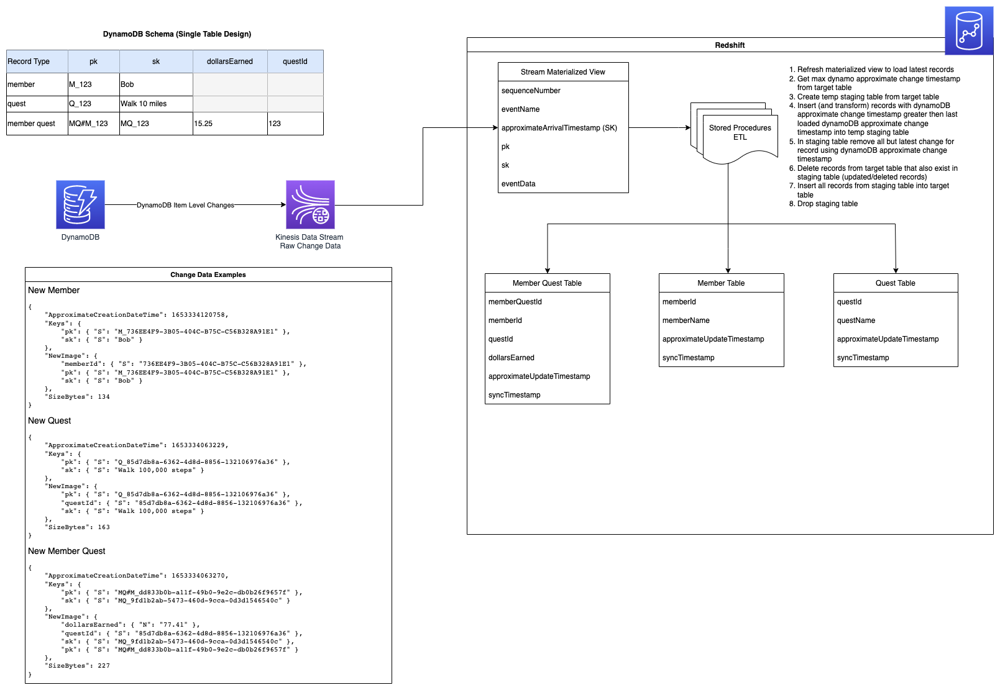

# Near Realtime Analytics of DynamoDB Data with Redshift Streaming Ingestion

This demo shows how you can use Redshift Streaming Ingestion (Preview) to sync DynamoDB data with Redshift in near realtime for ETL, Analytics, and Reporting all using SQL

## Data Flow Diagram




# Deployment

### Requirements

* aws cli
* NodeJS
* npm
* jq

## Deploy DynamoDB Data and Stream

Deploy DynamoDB table, data generator lambda, Kinesis Data Stream, and Redshift IAM Role

```
npm run deploy
```

## Deploy Redshift

Follow [Getting started with Amazon Redshift basics - Amazon Redshift](https://docs.aws.amazon.com/redshift/latest/gsg/new-user.html) to create a new a Redshift cluster and connect to it.

In the Redshift console, under **Redshift cluster permissions** add the exported RedshiftAssumeRole in `outputs.json` (created by `npm run deploy`) to Associated IAM roles